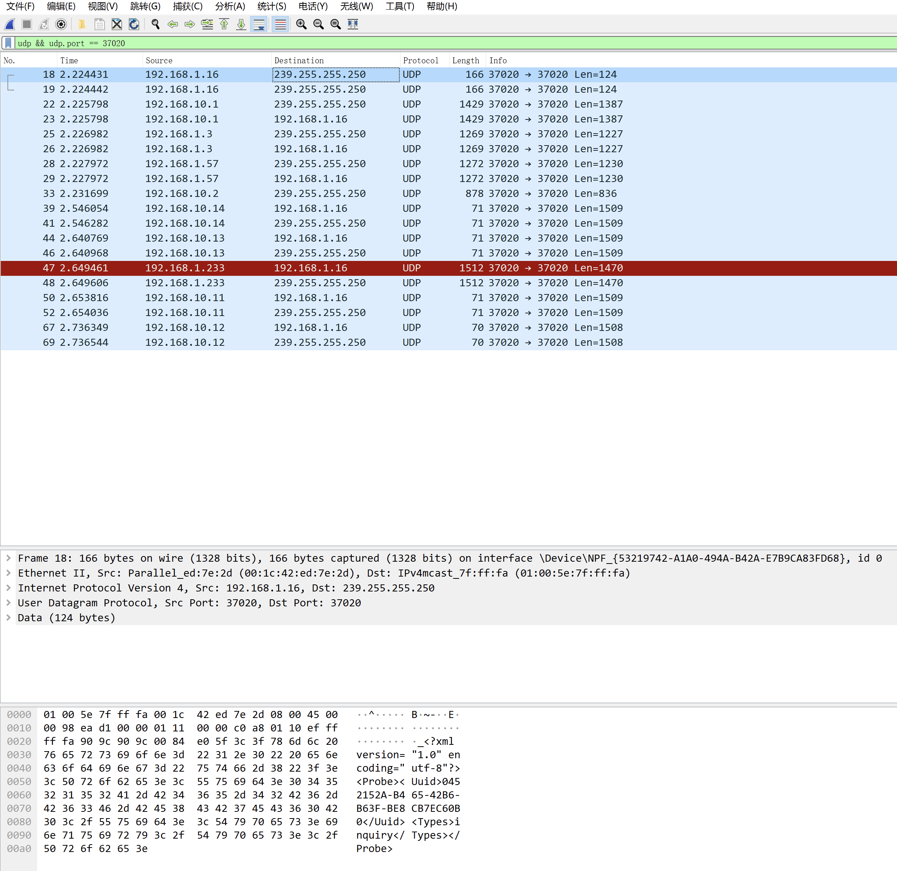

# Go-SADPTool
go语言写的类似SADPTool工具，搜索海康设备。

### 注意事项

⚠️⚠️⚠️如果存在多网卡，服务端可能作用在网络不可用的网卡上，有时间会增加网卡选择

### 1.首先启动server，监听端口37020

接收设备发送到本机的udp请求

### 2.启动client，发送udp组播

设备会向发起的udp组播的IP地址（也就是本机）发送设备信息，由最先启动的服务端server去接收设备发出udp请求。

### 3.本项目代码是根据海康SADPTool设备网络工具，通过wireshark抓包分析而来。

如果本项目对您有帮助，请点个star，感谢大家🙇‍🙇‍🙇‍！

