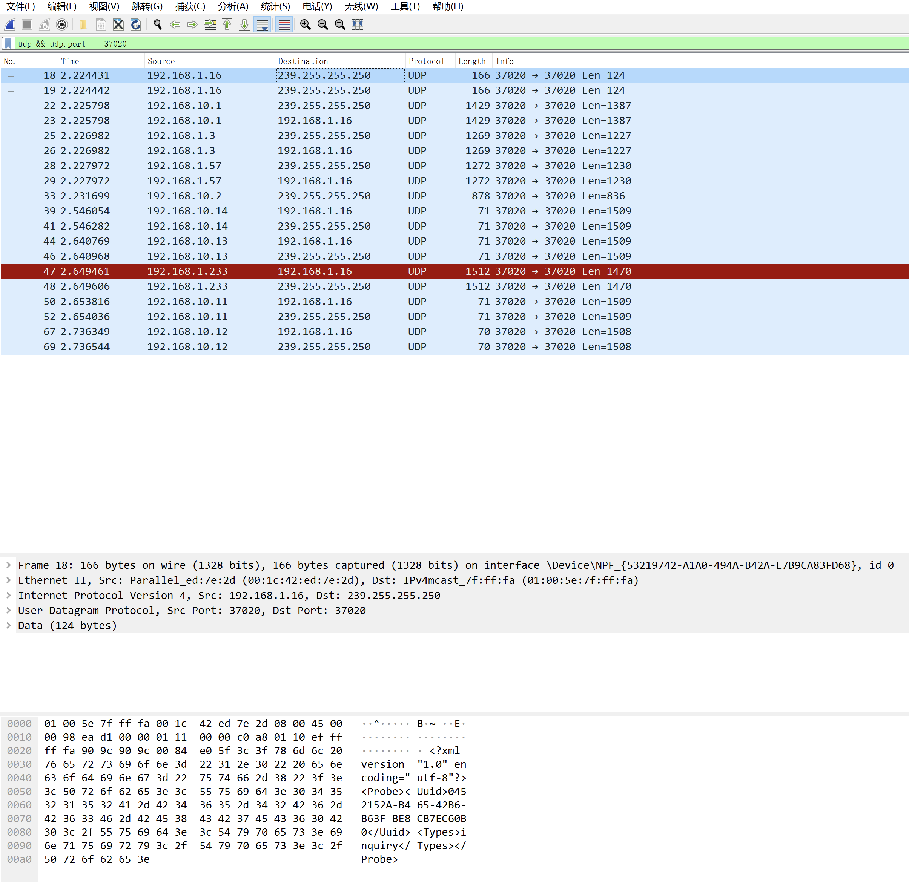

# go-hikvision
go语言写的类似SADPTool工具，搜索海康设备。

## 运行

```bash
go run main.go
```

运行结束后会得到一个`device.json`文件

多网卡环境下，可通过 `-i` 参数指定搜索使用的网卡（否则默认走系统默认路由的网卡，可能导致探测出错网卡）：

```bash
go run main.go -i eth3
```

不指定参数时保持默认行为，监听所有网卡。更多参数可通过 `go run main.go -h` 查看。

## 原理

项目运行后会监听端口`37020`，本机会向局域网中广播`探测数据`

```go
uuidString := strings.ToUpper(uuid.NewString())
req := model.Probe{
    Uuid:  uuidString,
    Types: "inquiry",
}
sendBytes, err := xml.Marshal(req)
```

接收到探测数据的设备会向发起的udp组播的IP地址（也就是本机）发送设备信息。

```go
n, _, err := conn.ReadFromUDP(data)
if err != nil {
    panic(err)
}
var ipc model.Device
err = xml.Unmarshal(data[:n], &ipc)
```

## 起源

本项目代码是根据海康SADPTool设备网络搜索工具，通过wireshark抓包分析而来。

PS：主要还是作者的电脑是Mac，运行不起来《SADPTool设备网络搜索工具》

